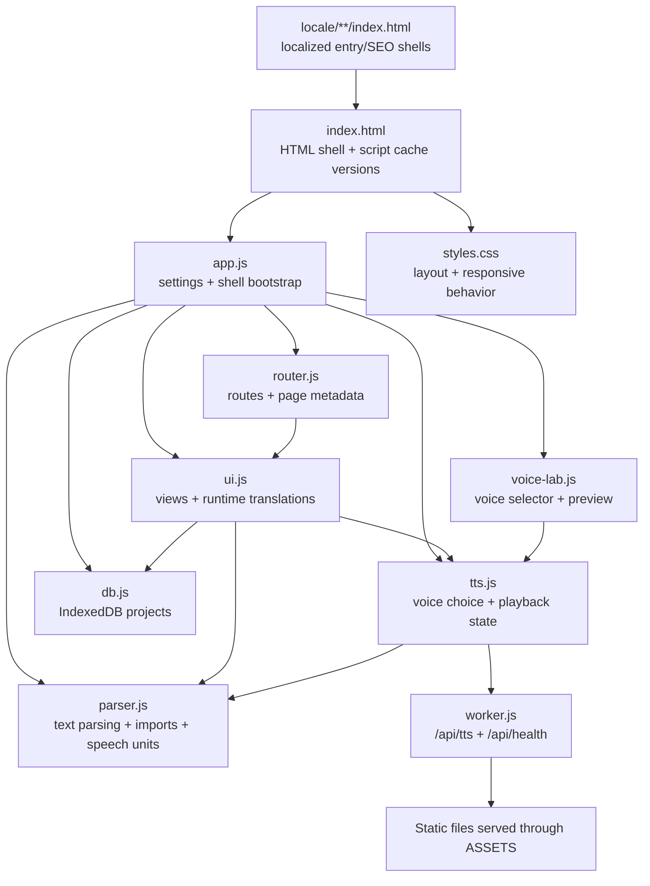

# DICTATE Project Map

A maintainer guide for finding the right code, understanding change dependencies, and validating updates. This describes the current repository as implemented; it does not assume a build system or generated locale source that does not exist yet.

## 1. Runtime Shape



The entry page is `index.html`. It loads classic scripts in dependency order and provides the shared shell. Localized static pages bootstrap that shell, then the runtime router/UI render the interactive page. Cloudflare is configured in `wrangler.json` to run `worker.js` before static assets for `/api/*`; the Worker serves other files through its `ASSETS` binding.

## 2. Where To Change Things

| Change | Primary owner | Also check |
| --- | --- | --- |
| App startup, settings, menus, theme | `app.js` | `index.html` script order; translations in `app.js` and `ui.js` |
| Route behavior, locale URL handling, SEO metadata | `router.js` | `404.html`, `_redirects`, `sitemap.xml`, `robots.txt`, route tests |
| Home/projects/reader/page rendering | `ui.js` | `styles.css`, `parser.js`, `db.js`, runtime UI translations |
| Text parsing, groups, headings, symbol/punctuation speech, file imports | `parser.js` | `tests/speech-symbols.test.mjs`, reader tests, script cache version |
| Native and online speech playback | `tts.js` | `worker.js`, `voice-lab.js`, TTS tests, script cache version |
| Voice options, labels, preview | `voice-lab.js` | `tts.js`, locale labels, script cache version |
| Project persistence / backup format | `db.js` | storage compatibility tests; do not casually change DB version or legacy stores |
| Styling, breakpoints, fixed mobile controls | `styles.css` | reader/mobile browser checks |
| Online TTS endpoint/provider/language map | `worker.js` | `wrangler.json`, `tts.js`, worker tests, privacy disclosures in `ui.js` and README |
| Static entry metadata/content for a public locale route | matching locale `*/index.html` | canonical/hreflang matrix and static route tests |
| Cloudflare deployment/asset routing | `wrangler.json`, `worker.js` | dry run with Wrangler; health and TTS endpoints after deploy |
| Script content changed | owning JS file | increment that script's `?v=` in `index.html`; static loaders use the root shell version `index.html?v=32` |

## 3. Add A Language: Required Procedure

The current locale set is repeated in multiple places. Until it is consolidated, use this checklist in order; do not add a language to only one dropdown.

1. **Define availability.** Decide separately whether the locale has UI translations, browser voice selection, online TTS provider support, and indexable public pages. A locale can be UI-only or speech-only; do not imply all voice engines support every locale.
2. **Runtime UI translations.** Add the locale to `UI_TEXT` in `app.js` and the main `UI_TEXT`/blog-copy structures in `ui.js`. Copy English keys intentionally, translate user-visible labels and messages, and add a complete localized online-TTS/privacy override in `ONLINE_TTS_PRIVACY_TEXT` if online speech supports that locale.
3. **Voice interface.** Add the locale name and preview text in `voice-lab.js`. Ensure the online option label and availability message are translated. Verify behavior with zero native voices as well as with a native voice present.
4. **Speech processing.** Add the locale to `ROUTER_LANGUAGES` in `router.js`, `uiLanguageOptions` and the speech-language allowlist in `app.js`, parser symbol and punctuation maps in `parser.js`, and `mapVoiceForLanguage()` in `worker.js` only if the provider supports it. Add locale-specific number/time/fraction rules only when their behavior is defined and tested.
5. **SEO metadata.** Add route titles/descriptions in `ROUTER_LOCALE_META` and `ROUTER_SECONDARY_META` in `router.js`. Update supported alternates in the public static pages, canonical/alternate matrix, and `sitemap.xml` where the page is intentionally indexable.
6. **Static entry pages.** Add the locale directory and the same public route entry pages as existing locales. These are duplicated HTML today; verify language tag, canonical, eight alternates including `x-default`, loader route, and current loader version for every entry.
7. **Selector and auto-detection.** Update the UI and speech language selectors, browser-language resolution, unsupported-language filters, and any explicit route/voice lists. Keep `auto` behavior distinct from a concrete language.
8. **Tests.** Extend `tests/seo-routes.test.mjs` route matrix, `tests/speech-symbols.test.mjs` locale checks, `tests/tts-locale-normalization.test.mjs`, and `tests/worker-free-tts.test.mjs` as appropriate. Add a test that rejects missing locale keys and missing map entries, rather than relying on English fallback to look complete.
9. **Validation.** Run `node --test tests/*.test.mjs`; run `node --check` on changed JS; run `git diff --check`; use `npx --yes wrangler@4 deploy --dry-run` for Worker/config changes. Smoke-test locale switching, reload/deep links, native-voice playback, and explicit online-voice consent.
10. **Cache and deploy.** Increment query versions for each changed browser-loaded script in `index.html`. Commit, push, deploy, then verify deployed script URLs and routes; source passing locally does not mean the deployed bundle updated.

## 4. Common Change Recipes

### Add or adjust a speech symbol

- Add the character to `SPEECH_SYMBOL_PATTERN` and a spoken form to every locale in `SPEECH_SYMBOLS`/`ADDITIONAL_SPEECH_SYMBOLS` in `parser.js`.
- Add a representative pronunciation assertion to `tests/speech-symbols.test.mjs`; the all-locale completeness test should catch omissions.
- Bump `parser.js?v=` in `index.html`.
- Run full tests and test the phrase in the target speech language.

### Change online TTS behavior

- Keep `tts.js` as the client playback/consent owner and `worker.js` as the provider proxy.
- If users' text leaves the device, retain explicit opt-in and update localized disclosures in `ONLINE_TTS_PRIVACY_TEXT` in `ui.js` plus the README privacy/network notes.
- Preserve GET audio support for tap-activated mobile playback and the provider character limit/chunking contract.
- Test no-consent, explicit online voice, preview, HTTP error, long/unbroken text, and language mapping. Bump the changed script version; validate Worker config and live endpoints after deployment.

### Add a public SEO page

- Add the runtime content in `ui.js` and route/meta ownership in `router.js`.
- Add static English and each supported locale entry page, canonical and reciprocal hreflang links.
- Update `tests/seo-routes.test.mjs`, `sitemap.xml`, and `robots.txt` if indexable.
- Verify FAQ JSON-LD comes from the same localized FAQ data as visible content.

### Change storage/project shape

- Update normalization and persistence in `db.js` while preserving old records.
- Add a migration only when the IndexedDB schema changes; bump its DB version deliberately.
- Add tests for old-record normalization, import/export compatibility, and deletion/undo.

## 5. Validation Commands

From the repository root:

```bash
node --test tests/*.test.mjs
node --check app.js
node --check db.js
node --check parser.js
node --check router.js
node --check tts.js
node --check ui.js
node --check voice-lab.js
node --check worker.js
git -c core.whitespace=cr-at-eol diff --check
npx --yes wrangler@4 deploy --dry-run
```

The Wrangler command requires network access and downloads the CLI via `npx`; it validates configuration/build packaging but does not deploy.

## 6. Current Structure Hazards

- Locale support is duplicated across UI dictionaries, selector arrays, router metadata, speech maps, worker voice maps, and static locale files. A future refactor should establish one locale registry for codes/names/capabilities, then generate selectors and coverage checks from it. Translation copy and static SEO page content still need separate authoring/review.
- English is often the silent fallback for missing runtime translations. Tests should make missing user-facing locale keys fail, so fallback remains a deliberate emergency path rather than masking incomplete translations.
- `index.html` script query versions are manually managed. Bump each modified script and add/update a test; localized shell loaders separately use `index.html?v=32`.
- `DICTATOR.WEB/` is a nested copy of the application tree. Confirm deployment/source ownership before mirroring edits there; do not assume it is generated or canonical.
- The public speech fallback depends on an unofficial no-signup upstream and can be rate-limited, changed, or discontinued. Keep browser speech primary, keep online use explicit, and provide a clear failure message.
- Static HTML entry pages duplicate metadata and starter content. Their tests currently validate routes and metadata but do not guarantee translation parity with runtime UI copy.
- A passing test suite and Worker dry run do not replace a real phone test, especially for mobile speech activation, voices, backgrounding, and audio output.
